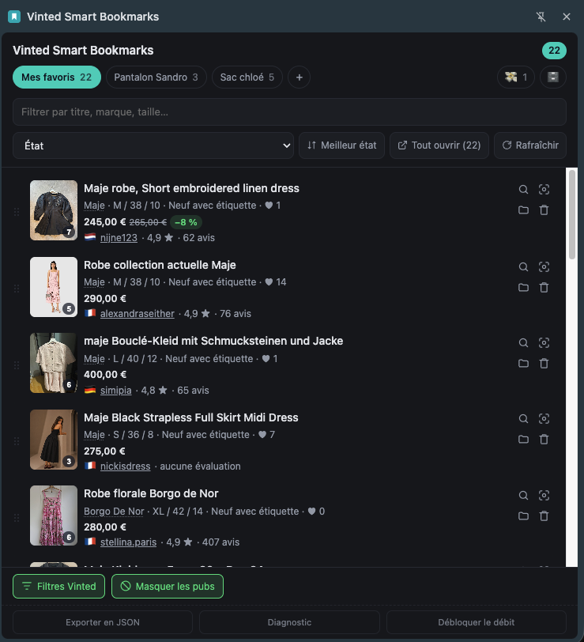

# Vinted Smart Bookmarks

A Chrome extension (Manifest V3) that saves Vinted listings locally and brings them back
in a side panel: collections, sorting, photo gallery, price and availability tracking,
ongoing offers, and a catalogue you no longer have to re-scan every day.

No server, no account — everything is stored on your machine. The only thing that ever
leaves the site is something you ask for: a "Chercher ailleurs" (search elsewhere)
button that runs a reverse image search (Google Lens) or a text search built from the
listing. The interface itself is in French, like the site it plugs into. See
`docs/specs/recherche-inversee.md`. Works on `vinted.fr`.



More screenshots: [price history](docs/screenshots/2.png) ·
[catalogue filters](docs/screenshots/3.png) ·
[filing into a collection from the page](docs/screenshots/4.png) ·
[photo gallery](docs/screenshots/5.png).

## Installation

### From a published release

1. Download the `.zip` from the [latest release][releases] and unpack it
2. Open `chrome://extensions`
3. Turn on **Developer mode** (top right)
4. Click **Load unpacked** → pick the unpacked folder
5. Pin the extension to the toolbar

The extension is not on the Chrome Web Store — manual installation is how it is meant to
be distributed.

[releases]: ../../releases/latest

### From source

```bash
pnpm install
pnpm build
```

Then load the **`dist/`** folder (not the repository root), following steps 2 to 5
above.

After every code change: `pnpm build`, hit ↻ on the extension card in
`chrome://extensions`, **then reload the Vinted tab**. Skip that last reload and
`chrome.storage` throws "Extension context invalidated" — clicks then fail silently.

## Usage

- **Search results** — a bookmark button appears in the top-right corner of each listing
  card (Vinted's own favourite button stays in the bottom-right, so the two never
  collide).
- **Listing page** — an "Enregistrer" (save) button floats in the bottom-right of the
  screen, and the same bookmark button shows up on the cards further down the page
  ("Member's wardrobe", "Similar items").
- **Side panel** — click the extension icon.
- **Long-press** (about half a second) on either button — or `Alt`+click — opens the
  collection picker: the listing is saved as usual, then filed straight into the
  collection you pick, without a detour through the panel. You can create a collection
  on the spot from that menu. `Esc` closes it without filing anything.
- **Pin a collection to the tab** from that same menu: a short click then saves straight
  into it, no long-press needed. The choice belongs to the tab and dies with it — one
  evening spent on Barbour jackets does not spill onto the next one.
- **Dismiss button** (⦸) — to the left of the bookmark, visible when the pointer is over
  the card: it hides listings you have already ruled out. See
  [Cutting the noise](#cutting-the-noise-out-of-the-catalogue).

Buttons stay in sync across every open Vinted tab.

### Collections

**Mes favoris**, the first tab, holds **everything you saved** — filed or not. It is not
a collection but a summary of the lot, and its counter overlaps the others on purpose.
The only listings it leaves out are the archived ones.

A collection is an optional label on top of that: file a listing into "Jeans" and it
shows up under both tabs. A listing that is only in Mes favoris is perfectly normal —
that is where every save starts.

- `+` creates a collection ("Jeans", "Shirts", "Gift for Julien"…)
- right-click a tab to rename it
- to file a listing: drag its handle onto the target tab, or use the folder icon on its
  row. "Aucune collection" (no collection) in that menu — or a drop on the **Mes
  favoris** tab — takes the label off again; the listing stays in your favourites
- in Mes favoris, a listing already filed carries a small **folder chip** naming its
  collection, and one click opens it. No chip means nothing has been filed yet
- a **cross** on a tab deletes the collection, even a full one: its listings are not
  lost, they simply go back to being unfiled. When it still holds listings, the panel
  asks first and says how many. **Mes favoris** never shows a cross — it is not a
  collection to delete.

### Photos

Clicking a listing's thumbnail opens **every photo from its page** without leaving the
panel. The badge in the corner of the thumbnail tells you how many there are.

Navigate with the arrows on either side of the image, the ←/→ keys, a swipe, or the
thumbnail strip. `Esc` or a click outside closes it.

Each photo loads at 600×800 first, then switches to 1200×1600 once the full-resolution
version arrives. A listing whose page could never be read has no gallery: its thumbnail
opens the Vinted tab instead. Nothing fetches it after the fact — saving the listing
again is what gives it one.

At the bottom of the viewer, **"Chercher cette photo"** runs a Google Lens search on the
image currently on screen (including the brand when it is known) — see
[docs/specs/recherche-inversee.md](docs/specs/recherche-inversee.md). Overlaid in the
bottom-left of the image, an expand icon **opens the photo at 1200×1600 in a new browser
tab**, outside the panel.

### The seller

The seller's username sits next to the price and links to their wardrobe. That is who
you negotiate with, and the first place to look for a second piece — shipping costs are
shared across several items from the same seller. Next to the name: their rating out of
5 and their number of reviews, plus a flag for the country, which costs one extra read
of `/member/{id}`.

All of this comes from the listing page: a listing whose page was never read keeps its
price line as it is until you save it again. The flag is the one field that can be
missing on its own — the member may simply not publish a location.

### Sorting and manual order

Six modes: **Personnalisé** (custom), **Date d'ajout** (date added), **Prix** (price),
**État** (condition), **Likes**, **Taille** (size). The button to the right of the
selector flips the direction, with a label that matches the mode ("Moins cher" —
cheapest — rather than a bare "ascending").

Custom order is set by dragging the `⠿` handle on the left of a listing. Dragging works
whatever mode is active: starting from an automatic sort simply switches to custom order
and freezes the order currently on screen. Each collection has its own order.

Reordering **while a search is active** only moves the listings you can see — the ones
hidden by the filter keep their position in the full order.

Scales used:

| Sort      | Order                                                              |
| --------- | ------------------------------------------------------------------ |
| Condition | Satisfactory → Good → Very good → New without tags → New with tags |
| Size      | Letter sizes first (XXXS → XXXL), then numeric ones (34, 36, 38…)  |

A listing missing the data being sorted on **always** ends up at the bottom, in both
directions, and the header says how many listings are in that situation. Some sorts are
still incomplete today — see [known limitations](docs/limitations.md).

### Exploring a brand

A listing's **brand**, dotted-underlined in the metadata line, opens the Vinted
catalogue filtered on that brand **within the listing's category**. Nothing else is
filtered: not price, not size, not condition — this is browsing a brand, not hunting for
an equivalent.

When the listing's category is not known for certain, the filter falls back to the brand
alone rather than risk the wrong category.

### Finding a similar listing

The magnifier icon on a listing opens the Vinted catalogue, pre-filtered:

| Criterion | Value                                                        |
| --------- | ------------------------------------------------------------ |
| Brand     | the listing's, filtered by id                                |
| Size      | the listing's, filtered by id                                |
| Category  | the listing's, when it is known for certain                  |
| Price     | from **half** to **double** the saved price (−50 % / +100 %) |
| Condition | New with tags, New without tags, Very good condition         |

The three conditions are **fixed**, whatever the original listing's condition is: the
point is to find a good deal, not a battered twin.

Both bounds can be tuned separately in `src/sidepanel/search.ts`: `PRICE_DOWN` (0.5 =
−50 %) and `PRICE_UP` (1 = +100 %). They round outwards, so a listing sitting exactly on
the boundary is not excluded.

Vinted only filters on numeric ids. Brand and category are read from the listing page;
size, which Vinted writes nowhere, is resolved from its label right after saving. All
three criteria are therefore exact — "42" no longer brings back shoe sizes when you were
after a waist.

Text search remains as a fallback: a listing whose page was never read, a brand Vinted
does not list, or a size that could not be resolved. Saving the listing again is enough
to bring it up to date. See [known limitations](docs/limitations.md).

### Price and availability tracking

A favourite is a purchase you have put off, and a listing from March still shows its
March price. **Rafraîchir** (refresh), in the sort bar, re-reads the pages of the
current collection; a **long-press** on it covers every collection at once.

- The requests come from an open Vinted tab, never from the service worker: they carry
  the session cookies and look like ordinary browsing. Without a Vinted tab the button
  says so, and the click opens one.
- The pace is deliberately held back — token bucket, daily budget, silence after a 429.
  When Vinted throttles us, the button turns into "Réessai N min" and **stays
  clickable**: it repeats the reason and the time it resumes.
- Every check writes a price point. A **−20 %** badge appears next to the price when it
  drops meaningfully, and clicking it opens the history as a step chart — between two
  readings the price was flat, so nothing is interpolated.
- A listing badged **"Vendu"** on its page is marked sold; two consecutive absences make
  it **"Retiré"** (gone) — never a single one.
- As soon as the tab you are looking at holds sold listings, a line under the sort bar
  offers to **hide** them or to **archive** them into the 🗄️ **Archives** tab, always
  last in the bar. From Mes favoris this sweeps every collection at once. Archiving is a
  move, not a delete, and an undo undoes it for 5 seconds — each listing going back to
  its own collection.

Details, rate-limiting strategy and data model: `docs/specs/suivi-prix.md`.

### Offers in progress

A listing under offer is neither an ordinary favourite nor a sold one: it is a decision
pending on someone else's side. The **"Sous offres"** tab lists those whose offer is
still live.

The listing page carries no trace of an offer — the data comes from the conversations
API (`/api/v2/inbox`, then one request per conversation), scanned from a Vinted tab
because it answers 403 without session cookies. The panel triggers a scan when it opens,
at most every 30 minutes, and works through the backlog of old conversations by slices.

The badge next to the price says who made the offer and how much, and opens the
conversation. **An offer that is over stays visible**, greyed out: "rejected at €42
three weeks ago" is exactly what stops you making the same offer twice. Only the "Sous
offres" tab restricts itself to live ones. See `docs/specs/offres.md`.

### Cutting the noise out of the catalogue

The same searches bring back the same results every day, and 90 % of what you see on
Monday you already ruled out on Sunday. The ⦸ button on a card takes it out of the way.

- A click does not make the card vanish: it folds into an **undo panel** for 2 seconds,
  which also offers to hide **everything from that brand**, or **from that seller** when
  the seller is known.
- **No network request, no message between the panel and the page.** The rules live in
  `chrome.storage.local`; the open Vinted tabs repaint on their own. **Nothing is ever
  deleted** — a floating pill counts what is hidden on the page and shows it all again
  in one click, and the ⦸ button of a card put aside by hand puts it back.
- **Filtres Vinted**, at the bottom of the panel, is where the rules are managed: hidden
  brands, excluded words, hidden sellers, listings put aside one by one — each
  removable. A preset adds the usual fast-fashion brands (Shein, Temu, Zara…) in one
  click.
- **Masquer les pubs** (hide ads), next to it, is a plain toggle, off by default: it
  takes the promoted inserts out of the feed.

Rules, matching and both interfaces: `docs/specs/filtrage-bruit.md`.

### Export and diagnostics

A **development bar** at the very bottom of the panel — meant to disappear from the
published build — offers a **JSON export** of every favourite, a **Diagnostic** to run
when something stops working (it tells you at a glance whether Vinted changed its DOM or
whether the click simply never reaches the button), and a way to **clear the rate
limiter** of the tracking cycle.

## Documentation

| Document                                | Contents                                          |
| --------------------------------------- | ------------------------------------------------- |
| [architecture.md](docs/architecture.md) | Files, data model, storage, concurrency           |
| [vinted-dom.md](docs/vinted-dom.md)     | Vinted DOM anchors and what to do when they break |
| [pitfalls.md](docs/pitfalls.md)         | Phantom clicks, repaint loops, drag and drop      |
| [diagnostic.md](docs/diagnostic.md)     | Reading the diagnostic report                     |
| [testing.md](docs/testing.md)           | Running the tests, harness, fixtures              |
| [limitations.md](docs/limitations.md)   | Known limitations                                 |

Specifications, written before the code and kept in step with it:

| Spec                                                      | Feature                                   |
| --------------------------------------------------------- | ----------------------------------------- |
| [suivi-prix.md](docs/specs/suivi-prix.md)                 | Price and availability tracking           |
| [offres.md](docs/specs/offres.md)                         | Offers in progress                        |
| [filtrage-bruit.md](docs/specs/filtrage-bruit.md)         | Cutting the noise out of the catalogue    |
| [recherche-inversee.md](docs/specs/recherche-inversee.md) | "Search elsewhere" — Google Lens and text |

To contribute: [CONTRIBUTING.md](CONTRIBUTING.md). To work on this repository with an
agent: [CLAUDE.md](CLAUDE.md).

## Development

Node 22+ and pnpm 10+ (`corepack enable` is enough to get the right pnpm).

```bash
pnpm install
pnpm dev        # rebuilds dist/ on every save
```

| Command          | Effect                                                   |
| ---------------- | -------------------------------------------------------- |
| `pnpm dev`       | development build in watch mode (sourcemaps, unminified) |
| `pnpm build`     | production `dist/`, minified                             |
| `pnpm test`      | 496 tests against real Vinted fixtures (~31 s)           |
| `pnpm typecheck` | `tsc --noEmit`                                           |
| `pnpm lint`      | ESLint + stylelint                                       |
| `pnpm format`    | Prettier, writing in place                               |
| `pnpm check`     | all of the above — what CI replays                       |
| `pnpm package`   | `artifacts/vinted-smart-bookmarks-<version>.zip`         |

### What the project enforces mechanically

The traps in this extension are silent — nothing shows up in the console. So three
guardrails are tooled rather than left to code review.

- **Content scripts stay IIFE.** Chrome accepts no runtime `import` there; an ES module
  would fail without a word. `tests/build-output.test.ts` checks it.
- **No `transform` on `:hover`** for injected buttons: the button moves out of its own
  hover area and oscillates, which swallows the click. A homegrown stylelint plugin
  (`tools/stylelint-no-hover-transform.js`) rejects it.
- **No Vinted CSS class in selectors**: they are obfuscated and change with every
  deploy. An ESLint rule forbids them.

### Publishing a release

The version lives in `package.json` alone — `src/manifest.ts` reads it, and the tag has
to match (the workflow fails otherwise).

```bash
pnpm version minor          # updates package.json and creates the tag
git push --follow-tags
```

The `release.yml` workflow replays `pnpm check`, builds the zip and creates the GitHub
Release. Every commit on `main` and every PR already produce a downloadable zip artifact
in the Actions tab, without creating a release.

### A note on TypeScript

TypeScript is deliberately held at **6.x**: `typescript-eslint` does not support TS 7
yet (its bound is `<6.1.0`) and refuses to start beyond it, which breaks `pnpm lint`
completely. Dependabot is told to ignore that major.
